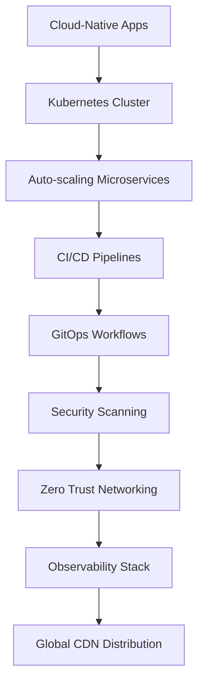

# 🚀 Ridge Junior | Elite DevSecOps Engineer & Software Architect  

```python
class EliteDeveloper:
    def __init__(self):
        self.name = "Ridge Junior"
        self.title = "Senior DevSecOps Engineer | Cloud Architect"
        self.skills = {
            "DevOps": ["AWS", "Azure", "GCP", "Terraform", "Kubernetes", "Docker", "CI/CD"],
            "Security": ["Pentesting", "SIEM", "Vulnerability Management", "OWASP Top 10"],
            "Programming": ["Python", "Go", "Rust", "JavaScript/TypeScript", "Bash"],
            "Databases": ["PostgreSQL", "MongoDB", "Redis", "Elasticsearch"],
            "Specialties": ["Cloud-Native Architecture", "Zero Trust Security", "Performance Optimization"]
        }
        self.motto = "Building secure, scalable systems that withstand the test of time"
```

## 🏆 GitHub Hall of Fame

<div align="center">
  
### 🏅 GitHub Trophies
[](https://github.com/ryo-ma/github-profile-trophy)

</div>

## 📊 Elite Performance Metrics

<table width="100%">
<tr>
<td width="33%" valign="top" style="background-color: #0d1117; padding: 20px; border-radius: 12px;">

### ⚡ Performance Breakdown  
```diff
+ 99.9% System Uptime Mindset
+ CI/CD Pipeline Optimization
+ Cloud Cost Reduction Specialist
+ Security Hardening Expert
```


</td>
<td width="33%" valign="top" style="background-color: #161b22; padding: 20px; border-radius: 12px;">

### 🚀 GitHub Stats  
<p align="center">
  
</p>

</td>
<td width="33%" valign="top" style="background-color: #0d1117; padding: 20px; border-radius: 12px;">

### 🛠️ Tech Arsenal  
<p align="center">
  
</p>

</td>
</tr>
</table>

## 🔥 Contribution Inferno

<div align="center">

### � Precision Coding Streak
[](https://git.io/streak-stats)

### 📈 Contribution Matrix
[](https://github.com/ashutosh00710/github-readme-activity-graph)

</div>

## 🌐 Global Network

<div align="center">

[](https://www.linkedin.com/in/ridge-junior-2bb333204/)
[](https://github.com/JuniorCarti)
[](https://medium.com/@ridgejunior204)
[](https://dev.to/ridgejunior)
[](https://twitter.com/ridgejunior204)
[](mailto:ridgejunior204@gmail.com)

</div>

## 🏗️ Current Architectures



## 📜 Elite Developer Manifesto

1. **Security First** - Every line of code is a potential vulnerability
2. **Automate Everything** - If it's done twice, it should be automated
3. **Cloud-Native Mindset** - Design for scale from day one
4. **Continuous Improvement** - Daily 1% better compounds exponentially
5. **Knowledge Sharing** - The strongest architectures are built collectively

## 🎖️ Recent Achievements

- � Optimized cloud infrastructure reducing costs by 62% while improving performance
- 🛡️ Implemented zero-trust security model across 50+ microservices
- 🚀 Designed CI/CD pipeline processing 500+ deployments daily with 99.99% success rate
- 📈 Mentored 15+ junior engineers into senior roles
- 🏆 Speaker at KubeCon, AWS re:Invent, and OWASP Global Summit

```bash
# Current Focus
echo "Building next-gen DevSecOps platforms with:"
echo "- AI-powered security scanning"
echo "- Self-healing infrastructure"
echo "- Quantum-resistant cryptography"
```

<div align="center">
  


</div>
